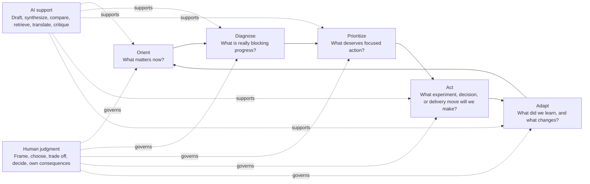
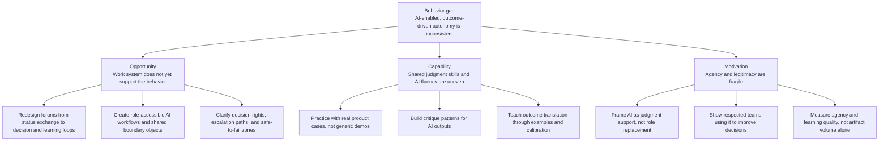

# AI-Enabled Product Work Needs a Better Work System

Product teams are being asked to become more AI-enabled, more outcome-driven, and more strategically autonomous at the same time.

That is not just a tooling rollout. It is a behavior change problem inside a work system that was designed for a different era: meetings as alignment, documents as coordination, roadmaps as promises, and product judgment concentrated in a few roles.

The practical question is not whether AI can generate stories, plans, explainers, or status updates. It can. The practical question is whether those outputs improve shared judgment, alignment, and agency in the system.

## Executive Summary

The current pattern is a three-way squeeze:

| Pressure | What teams are being asked to do | Why it is hard |
|---|---|---|
| AI-enabled work | Use AI to accelerate discovery, planning, writing, synthesis, and communication | Access, confidence, workflow fluency, and safety vary widely across roles |
| Outcome-driven work | Translate vague goals into customer behavior, sentiment, experiments, and decisions | This requires interpretation, trade-off reasoning, and shared definitions, not just templates |
| Strategic autonomy | Own prioritization and direction closer to the work | Forums often remain reactive, status-oriented, and low in safety for dissent or uncertainty |

The system is producing a predictable result: AI adoption appears in pockets, engineering workflows accelerate faster than product/stakeholder collaboration, and standardized artifacts multiply faster than common meaning.

The highest-leverage intervention is to redesign the operating loop, not to push more tools. AI should reduce friction around synthesis, drafting, comparison, retrieval, and translation. Humans must still own problem framing, outcome judgment, trade-offs, ethical boundaries, and the decision to act.

:::callout tip
Treat AI as a way to make judgment visible and testable, not as a way to bypass judgment.
:::

:::quiz
What is the central diagnosis?
- ( ) Product teams are resisting AI because they dislike new tools.
- (x) The work system is asking for new behaviors without yet providing the capability, opportunity, and motivation conditions that make those behaviors reliable.
- ( ) The main fix is to standardize more planning artifacts.
> The issue is not basic tool preference. The target behavior requires shared models, safe forums, decision rights, practice, time, feedback, and legitimacy.
:::

# The Target Behavior

The behavior to diagnose:

**Product teams regularly use AI-enabled work practices to improve outcome reasoning, cross-role collaboration, story quality, prioritization, and adaptation while preserving human ownership of judgment and trade-offs.**

| Canvas field | Working definition |
|---|---|
| Who | Product managers, designers, engineers, product leaders, stakeholders, and AI enablement partners |
| Will do what | Use AI to support discovery synthesis, story slicing, option generation, explanation, planning, critique, and learning loops |
| To what extent | As a repeatable team capability embedded in core product rituals, with visible reasoning quality and decision outcomes, not just artifact volume |
| In what context | Enterprise product organization with established rituals, uneven AI access, different role fluencies, standardizing roadmaps/status artifacts, and rising expectations for autonomy |
| For what outcome | Faster learning, clearer trade-offs, better customer-outcome translation, stronger alignment, and more distributed agency |
| Current state | Partially realized and inconsistent: strong pockets exist, but adoption and meaning vary across roles and teams |
| Prior attempts implied | Tool access, standard artifacts, planning templates, roadmap/status normalization, AI-generated documents, and emerging engineering AI workflows |

The behavior is multi-actor. One role's output becomes another role's input. A generated story affects engineering planning. A customer-outcome framing affects discovery and prioritization. A status artifact affects leader confidence and stakeholder behavior. Failures concentrate at these handoffs.

# Systems Walkthrough

The operating loop needs to become explicit:

## Orient

Teams need a shared view of what matters now: customer outcome, business constraint, time horizon, current confidence, and decision context.

AI can help collect and compress source material. Humans must decide what frame is legitimate and what trade-offs are on the table.

## Diagnose

Teams need to distinguish symptoms from causes. A vague goal such as "improve discovery" has to become measurable customer behavior, sentiment, friction, and experimentable hypotheses.

AI can propose candidate signals and summarize evidence. Humans must judge which signals are valid, which are noisy proxies, and what the organization is willing to learn.

## Prioritize

Teams need to choose under scarcity. Prioritization is not ranking a backlog; it is deciding what deserves scarce attention given uncertainty and opportunity cost.

AI can surface options, summarize arguments, expose inconsistencies, and stress-test assumptions. Humans must own value judgments, risk appetite, sequencing, and the decision not to do attractive work.

## Act

Teams need to turn decisions into coherent slices of work. Story writing becomes a team capability, not a PM handoff task.

AI can draft stories, acceptance criteria, examples, test ideas, and explainers. Humans must ensure the story expresses intent, quality, customer value, and trade-offs that the team actually understands.

## Adapt

Teams need to close the loop. Did the artifact improve action? Did the experiment change confidence? Did the story preserve intent through delivery? Did the roadmap help people make better decisions?

AI can compare intended versus observed outcomes and generate learning summaries. Humans must decide what the learning means and whether the operating model needs to change.

:::reveal Where does the loop most often fail?
It usually fails between Diagnose and Prioritize, or between Act and Adapt. Teams can create artifacts, but the artifacts do not always change decisions or learning. That is the difference between output acceleration and agency improvement.
:::

# COM-B Diagnosis

COM-B says behavior depends on **Capability**, **Opportunity**, and **Motivation**. In this case, Opportunity is the largest constraint, Capability is uneven and role-specific, and Motivation is mixed because the same AI behavior can feel empowering, performative, risky, or identity-threatening depending on the local context.

## Capability

| Dimension | Diagnosis | Evidence from the pattern |
|---|---|---|
| Shared representations | Low to mixed | Roadmaps, status indicators, and planning artifacts are becoming standardized, but common meaning is still missing |
| Judgment under uncertainty | High demand, uneven support | Teams are asked to translate vague goals into behavior signals, experiments, trade-offs, and strategy |
| Procedural fluency | Uneven | Engineers are moving faster with AI SDLC patterns, while PMs/designers/stakeholders have less consistent access to workflows and practice |
| Metacognition and calibration | Needed | Teams need to know when an AI-generated artifact is useful, misleading, shallow, overconfident, or missing context |

Capability is not simply "teach people AI." The capability gap is the ability to use AI inside product judgment: framing, synthesis, comparison, critique, and decision support.

## Opportunity

| Dimension | Diagnosis | Evidence from the pattern |
|---|---|---|
| Work-system coherence | Low | Engineering AI workflows are accelerating faster than product/stakeholder collaboration practices |
| Tool-task fit | Uneven | Tools, skills, and technical workflows are not equally accessible across roles |
| Workflow and handoffs | Fragile | Story writing is shifting from PM-owned task to team capability, but handoff norms still lag |
| Voice safety and power | Constrained | Communication forums feel reactive and lower in psychological safety |
| Governance and autonomy | In transition | Teams are asked for more strategy ownership while existing forums still pull toward status and escalation |

Opportunity is the primary bottleneck. People cannot reliably enact a new behavior when the local work system still rewards old behavior.

## Motivation

| Dimension | Diagnosis | Evidence from the pattern |
|---|---|---|
| Autonomous motivation | Present but fragile | PMs and designers are interested, but adoption is uneven |
| Efficacy | Uneven | Some roles have strong exemplars and practice; others face unclear entry points |
| Identity and legitimacy | Contested | AI can feel like leverage, deskilling, role confusion, or performative modernization |
| Learned controllability | At risk | If AI-generated artifacts do not change decisions or safety, people learn that participation is cosmetic |

The risk is not lack of enthusiasm. The risk is learned cynicism: "We are producing new artifacts, but the same decisions happen in the same way."

:::callout warning
When people experience AI as another compliance surface, adoption metrics can rise while agency falls.
:::

# Friction AI Can Reduce vs Judgment Humans Must Own

| Work | AI can reduce friction by... | Humans must still own... |
|---|---|---|
| Sensemaking | Summarizing interviews, feedback, telemetry notes, prior decisions, and open questions | Deciding what evidence is credible and what is missing |
| Outcome translation | Generating candidate behavior signals, sentiment signals, leading indicators, and experiment ideas | Choosing valid measures and avoiding proxy gaming |
| Story writing | Drafting slices, acceptance criteria, examples, edge cases, and test ideas | Preserving intent, scope, quality, and trade-off context |
| Prioritization | Comparing options, surfacing assumptions, summarizing opportunity cost, generating decision memos | Making value judgments under uncertainty |
| Communication | Tailoring explanations for different audiences and compressing status into decision-relevant updates | Creating truthful alignment, not message polish |
| Learning loops | Comparing planned outcomes with observed results and drafting retrospectives | Deciding what changed, what to stop, and what to try next |

AI is strongest when the task is information-heavy, pattern-rich, repetitive, or translation-heavy. Humans are essential where the task requires values, commitments, accountability, legitimacy, or context-sensitive judgment.

# Intervention Points

The intervention map should start with the work system, then build capability and motivation inside that redesigned context.

## Practical Interventions

| Intervention | What changes | Why it helps |
|---|---|---|
| Decision-centered forums | Replace some status review time with structured decisions, trade-offs, and learning reviews | Moves the system from reactive reporting to agency-building |
| Shared AI workbench practices | Give each role accessible examples for synthesis, story critique, outcome translation, and stakeholder explanation | Reduces uneven capability without making one role the AI gatekeeper |
| Human judgment checkpoints | Require explicit "what we believe, what we chose, what we are not doing, and why" in AI-supported artifacts | Prevents artifact polish from substituting for reasoning |
| Outcome translation clinics | Practice turning vague goals into behavior signals, sentiment signals, experiments, and stopping rules | Builds the hardest product judgment capability |
| Safe-to-fail AI experiments | Let teams test AI-supported workflows on bounded decisions with visible learning | Builds efficacy without pretending the whole operating model is solved |
| Artifact usefulness measures | Track whether generated outputs improved decision speed, quality, clarity, or learning | Keeps measurement focused on system improvement rather than production volume |
| Cross-role story writing | Treat story creation as a team reasoning exercise with AI as a drafting partner | Reduces PM bottlenecks while preserving shared ownership of intent and quality |

:::quiz
Which intervention is most consistent with the diagnosis?
- ( ) Mandate a fixed number of AI-generated stories per sprint.
- ( ) Ask each team to adopt the newest AI tool and report usage.
- (x) Redesign a recurring product forum so teams use AI-supported synthesis to make clearer decisions, record trade-offs, and close learning loops.
> The diagnosis points to work-system redesign and judgment support, not compliance metrics or tool enthusiasm.
:::

# Where AI Increases Agency

AI increases agency when it gives teams more usable control over the work:

| Agency pattern | What it looks like |
|---|---|
| More people can enter the work | Non-specialists can ask better questions, draft first passes, and understand context faster |
| Reasoning becomes visible | Assumptions, options, evidence, and trade-offs are easier to inspect |
| Teams can rehearse decisions | AI can simulate stakeholder questions, edge cases, customer objections, and failure modes |
| Learning loops get shorter | Teams can compare intent and evidence faster, then adapt sooner |
| Communication becomes more precise | Different audiences receive clearer explanations without losing the underlying logic |

# Where AI Becomes Compliance Theater

AI becomes compliance theater when the system rewards visible adoption more than improved judgment.

| Theater pattern | Signal |
|---|---|
| Artifact inflation | More plans, stories, summaries, and status updates appear, but decisions do not improve |
| Prompt performance | People demonstrate AI usage to satisfy expectations rather than to improve work |
| Polished ambiguity | AI makes unclear thinking sound coherent |
| Centralized gatekeeping | A small expert group becomes the only path to AI-enabled work |
| Metric substitution | Adoption dashboards replace evidence of better outcomes, learning, or autonomy |
| Safety bypass | AI accelerates output in forums where people still cannot question assumptions or disagree safely |

:::callout warning
The strongest warning sign is when AI makes the old operating model look modern without changing who can reason, decide, learn, or challenge.
:::

# What AI Should Do / Should Not Do

| AI should do | AI should not do |
|---|---|
| Draft first versions that humans critique | Create final artifacts that bypass team understanding |
| Summarize evidence with uncertainty and gaps | Convert weak evidence into confident language |
| Generate alternative framings and options | Collapse disagreement into a single polished narrative |
| Help translate outcomes into measurable signals | Treat any available metric as a valid outcome |
| Expose assumptions, risks, and trade-offs | Hide trade-offs behind generic best-practice language |
| Support cross-role participation | Make technical fluency the price of admission |
| Shorten learning loops | Optimize for artifact throughput |
| Help teams prepare for difficult conversations | Replace the difficult conversation |

# Good AI Uses and Bad AI Uses

| Good AI use | Why it is good |
|---|---|
| "Here are three ways to frame this customer outcome, with possible behavior signals and risks of each signal." | Supports judgment and exposes trade-offs |
| "Critique this story for unclear intent, hidden scope, weak acceptance criteria, and missing customer value." | Improves quality without replacing ownership |
| "Summarize these discovery notes into patterns, contradictions, and questions we need to validate." | Reduces synthesis load while preserving uncertainty |
| "Generate a decision memo with options, assumptions, evidence quality, and a recommendation." | Makes reasoning inspectable |
| "Role-play skeptical stakeholder questions before the team presents a prioritization call." | Builds readiness for real communication |
| "Compare what we expected to learn with what happened and suggest follow-up hypotheses." | Supports adaptation and loop closure |

| Bad AI use | Why it is bad |
|---|---|
| "Generate the roadmap so we can align faster." | Risks replacing strategic conversation with artifact polish |
| "Turn this vague priority into stories without clarifying the outcome." | Produces delivery motion without shared intent |
| "Make this status update sound confident." | Can conceal uncertainty and reduce trust |
| "Use AI adoption counts as the primary success metric." | Measures tool use instead of improved work |
| "Ask AI to decide the priority order." | Outsources value judgment and accountability |
| "Use AI to avoid involving stakeholders until the output looks finished." | Reduces collaboration and increases late-stage rework |

# A Useful Success Standard

Do not ask only, "Are teams using AI?"

Ask:

| Better question | Why it matters |
|---|---|
| Are teams making better trade-offs faster? | Tests decision quality, not tool usage |
| Are vague outcomes becoming clearer experiments? | Tests outcome-driven behavior |
| Are more roles able to participate meaningfully? | Tests distributed agency |
| Are disagreements surfaced earlier and handled better? | Tests psychological safety and governance |
| Are artifacts changing decisions and learning loops? | Tests whether outputs affect the system |
| Are teams able to explain what AI helped with and what humans owned? | Tests boundary clarity |

:::reveal What would be a misleading early success metric?
"Number of AI-generated artifacts" is misleading on its own. It may rise when the system is learning, but it can also rise when people are producing compliance evidence. Pair it with decision quality, cycle time to learning, stakeholder clarity, and team agency signals.
:::

# What I'd Love Feedback On

1. Does this diagnosis put enough weight on the work system, or does it still sound too tool-centered?
2. Where would you draw the boundary between useful artifact standardization and artifact theater?
3. What signals would convince you that AI is improving product judgment rather than just increasing throughput?
4. How would you design a forum where PMs, designers, engineers, and stakeholders can use AI support without flattening dissent?
5. What is the smallest practical intervention that would increase agency without creating a new layer of process?
6. Which parts of the COM-B diagnosis feel underweighted: capability, opportunity, or motivation?

# Closing Thought

The durable shift is not "product teams use AI." The durable shift is that product teams become better at orienting, diagnosing, prioritizing, acting, and adapting with clearer judgment and more distributed agency.

AI can help. But only if the work system is redesigned so better thinking has somewhere to go.
