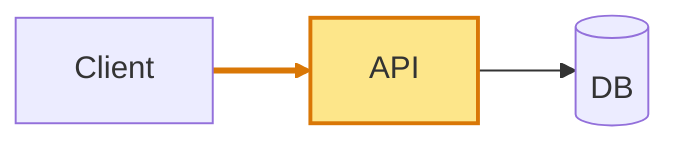
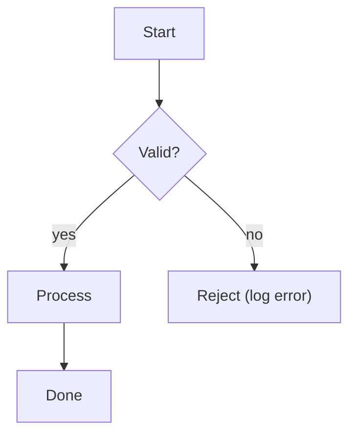
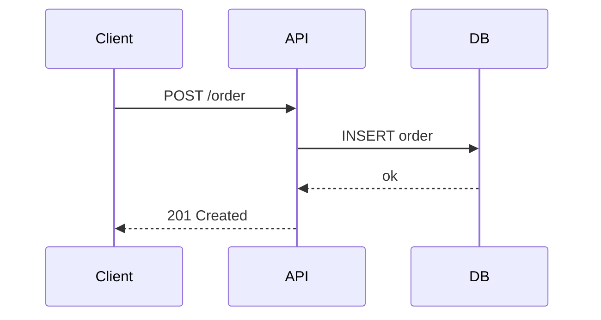
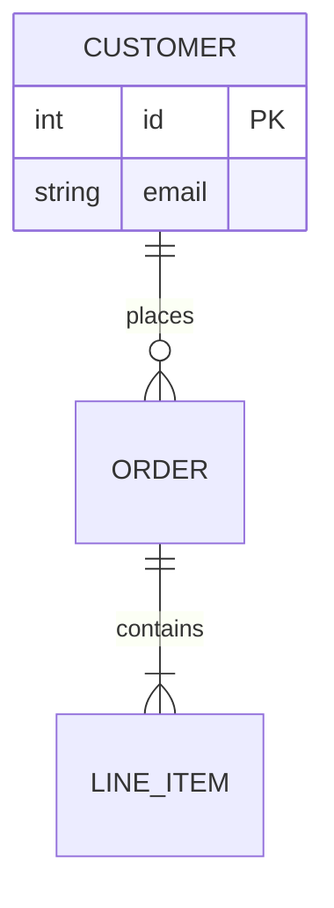
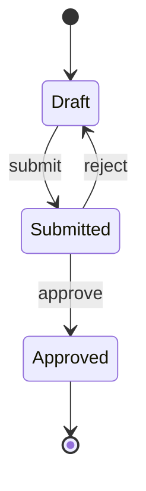
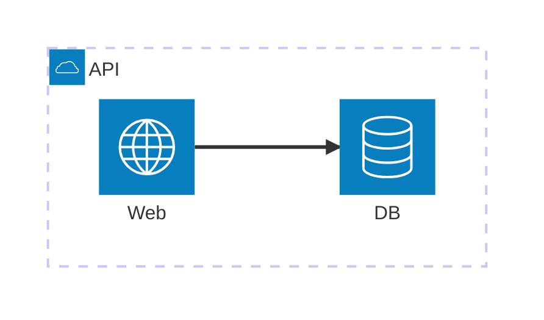
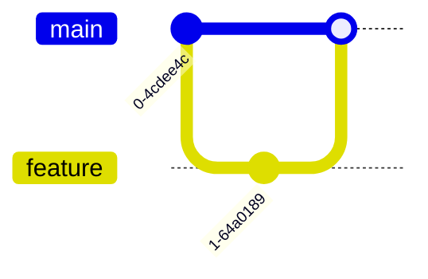

# Diagrams

## Purpose

Use diagrams when the structure of the idea is easier to understand visually than in prose alone.

Pick diagrams by the shape of the idea, not by reflex. A diagram that does not carry meaning adds load and should be cut.

In Substack HTML preview pages, use:

```html
<pre class="mermaid">
flowchart LR
  A["Client"] --> B["API"]
</pre>
```

## Which Diagram To Use

| You're explaining... | Use | Keyword |
|---|---|---|
| A process, control flow, data flow, or pipeline | flowchart (`TD` for procedures, `LR` for pipelines) | `flowchart` |
| An interaction across components over time, such as client to API to DB | sequence | `sequenceDiagram` |
| A data model or schema change | ER | `erDiagram` |
| A type hierarchy or OO refactor | class | `classDiagram` |
| A lifecycle or status machine | state | `stateDiagram-v2` |
| The system's parts and how they connect | architecture, if the renderer supports it | `architecture-beta` |
| How the code got here in git | git | `gitGraph` |
| Decomposition of one idea or feature | mindmap | `mindmap` |
| Events across time, such as plan phases or milestones | timeline | `timeline` |

For explaining changes, the workhorses are usually:

- flowchart for the change's logic or data flow
- sequence for the runtime interaction it touches
- before/after structure using a `.diff` component or two small flowcharts

Lead with the simplest sufficient diagram.

## Make The Changed Thing Loudest

Highlight the one path or node that matters with `classDef` and `class`:



Use 2-3 semantic colors at most, such as:

- amber = changed
- green = added
- gray = unchanged context

Pair color with a label. Never rely on color alone.

Cap a diagram at roughly 7 plus or minus 2 nodes. Beyond that, split it or use `subgraph`. Keep one idea per diagram.

## Syntax Rules That Prevent Broken Renders

These cause many real-world Mermaid failures:

1. Quote any label with spaces plus punctuation or special characters: `()`, `{}`, `[]`, `:`, `#`, `&`, `<`, `>`. Example: `A["fetch(url) returns {json}"]`. When in doubt, quote every label.
2. Never use bare `end` as a node id or lone label in flowcharts. Capitalize it as `End` or quote it.
3. Use `<br>` inside a quoted label for line breaks, not a raw newline.
4. Use current diagram names: `flowchart`, not legacy `graph`; `stateDiagram-v2`, not the older state syntax.
5. In sequence diagrams, alias participants with colons using `as`: `participant DB as "Postgres: primary"`.
6. In class diagrams, use `~` for generics instead of angle brackets: `Repository~T~` renders as `Repository<T>`.
7. In ER diagrams, include the relationship label after cardinality: `CUSTOMER ||--o{ ORDER : places`.
8. Put comments on their own lines with `%%`. Put direction (`TD`, `LR`, and so on) only on the header line.
9. `mindmap` and `timeline` indentation is structural. Keep it consistent.

## Correct Skeletons

### Process Or Data Flow



### Interaction Over Time



### Data Model



### Lifecycle



### System Parts

Use `architecture-beta` only when the preview renderer supports it.



### Git History



## ASCII Fallback

When a tiny diagram is clearer inline, ASCII works everywhere and needs no render step:

```text
+--------+    +-----+    +----------+
| Client | -> | API | -> | Database |
+--------+    +-----+    +----------+
```

Use arrows consistently, keep boxes under about 72 columns, and annotate the changed box with a trailing `changed`. For anything past roughly 6 nodes, switch to Mermaid.
